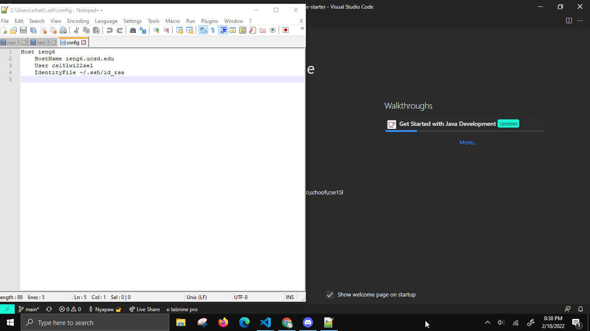
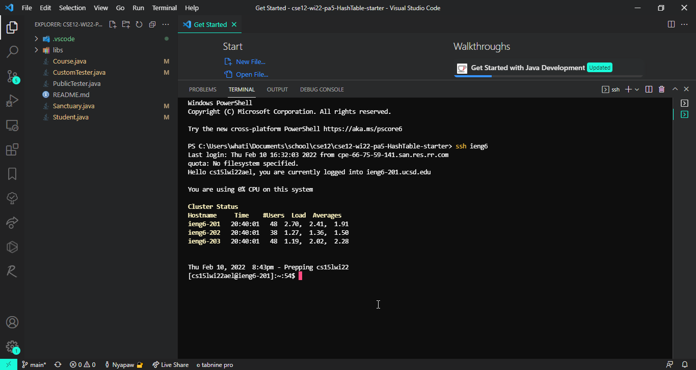
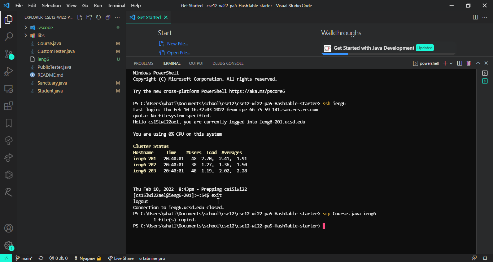

# Week 6 lab report
# Streamlining ssh Configuration

Show your .ssh/config file, and how you edited it (with VScode, another program, etc)
-

I went into `~/.ssh/config` and used Notepad++.

Show the ssh command logging you into your account using just the alias you chose.
-

Show an scp command copying a file to your account using just the alias you chose.
-
