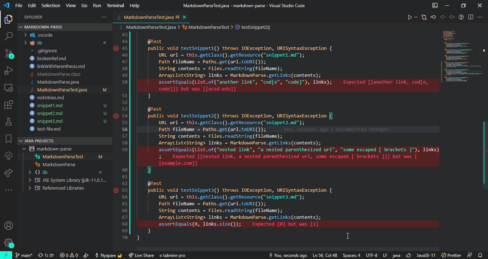
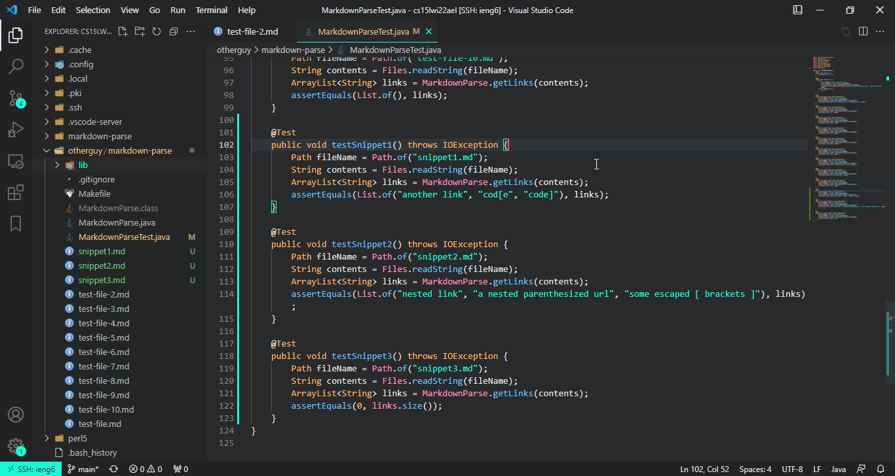
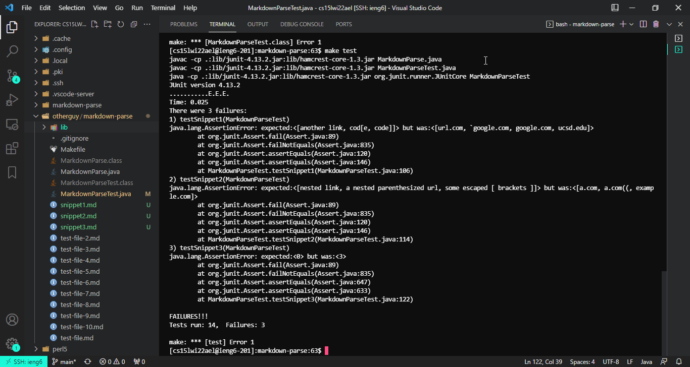

# Week 8 lab report

A link to your markdown-parse repository and a link to the one you reviewed
--

https://github.com/ethanucsd/cse15l-lab-reports
https://github.com/yih365/markdown-parse

---

### For each test above:
### Decide on what it should produce by using either VScode preview or the CommonMark demo site

Test 1
`"another link", "cod[e", "code]"`

Test 2
`"nested link", "a nested parenthesized url", "some escaped [ brackets ]"`

Test 3 `""`

### Showing the code in MarkdownParseTest.java for how you turned it into a test

### *Mine*

### *Other*

### For your implementation, the corresponding output when running the tests; if it passed, say so. If it didn’t pass, show the specific part of the JUnit output that shows the test failure.

***None of them passed***

### For the implementation you reviewed, the corresponding output when running the tests; if it passed, say so. If it didn’t pass, show the specific part of the JUnit output that shows the test failure.

***None of them passed***

---
## Answer the following questions with 2-3 sentences each:

### Do you think there is a small (<10 lines) code change that will make your program work for snippet 1 and all related cases that use inline code with backticks? If yes, describe the code change. If not, describe why it would be a more involved change.

There is a code change that can account for this edge case that is small, and that is checking whether or not line has tick in the beginning,which nullifies the link. By doing this, you just simply check the first 0 index of the string for it.

### Do you think there is a small (<10 lines) code change that will make your program work for snippet 2 and all related cases that nest parentheses, brackets, and escaped brackets? If yes, describe the code change. If not, describe why it would be a more involved change.

There is not a small code change that can account for this edge case, in the case of nested links, you would have to check recursively within the string for the Most nested bracket and parentheses. This would need a Complex method regarding string splices.

### Do you think there is a small (<10 lines) code change that will make your program work for snippet 3 and all related cases that have newlines in brackets and parentheses? If yes, describe the code change. If not, describe why it would be a more involved change.

My code seems to fail for the case in which it included "https://cse.ucsd.edu/" despite the test not including anything for the expected part.This is also not a small code change because my code works by taking the markdownparse line by line finding a set of brackets and parentheses, and to fix this, I would have to write a complex method to iterate through the entire markdown parse file to find if the parentheses is faulty.