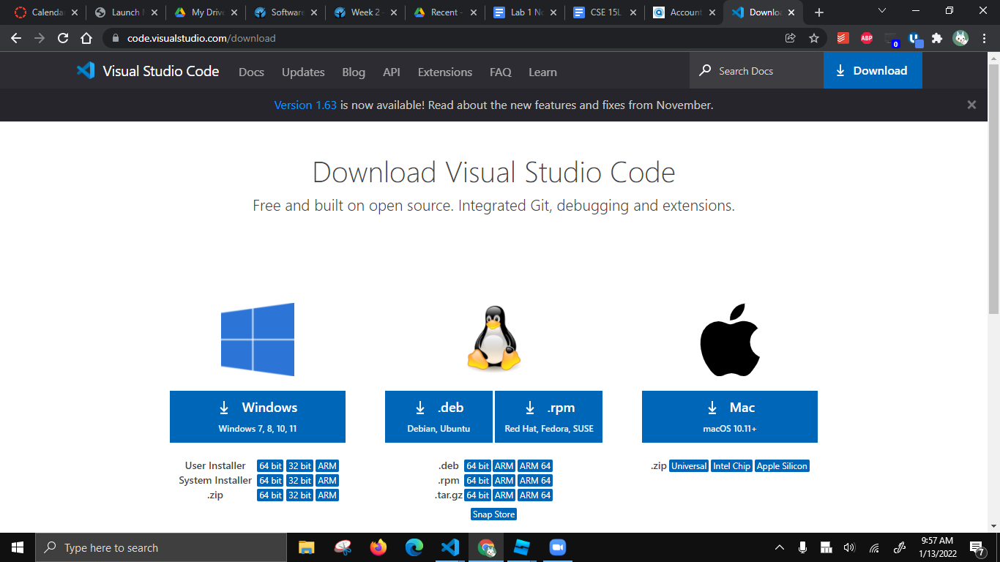
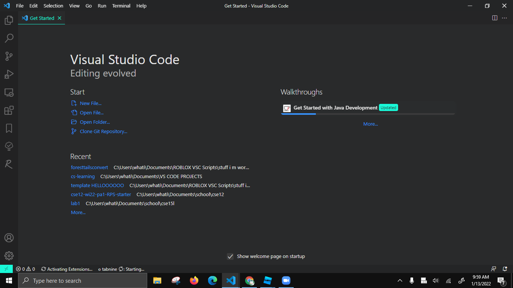
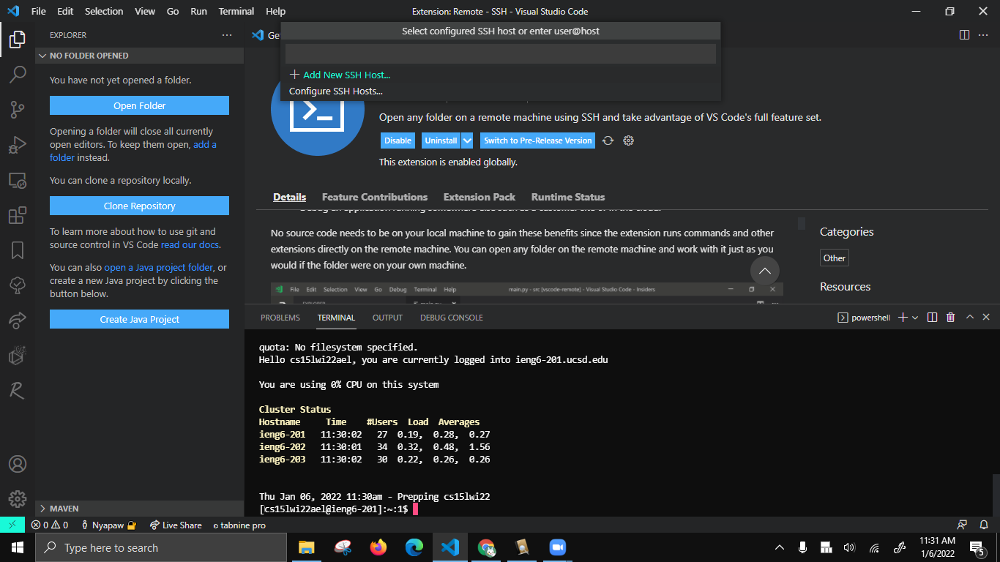
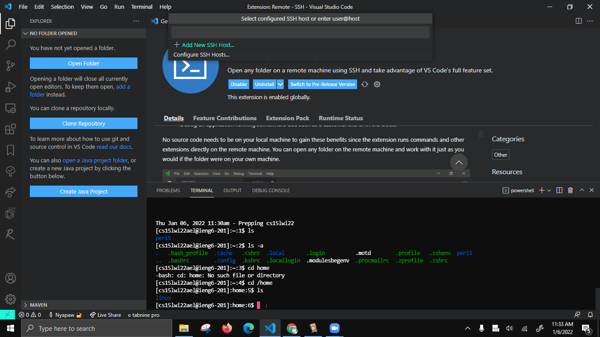
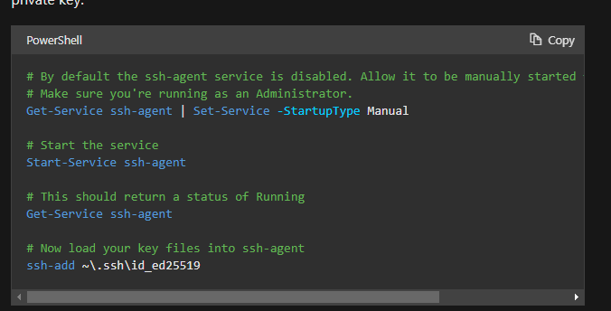
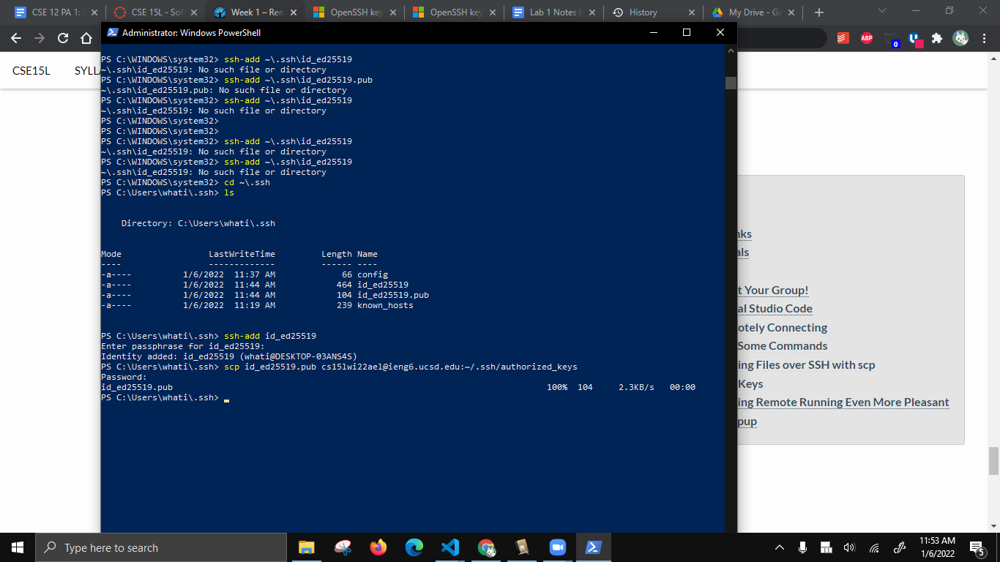
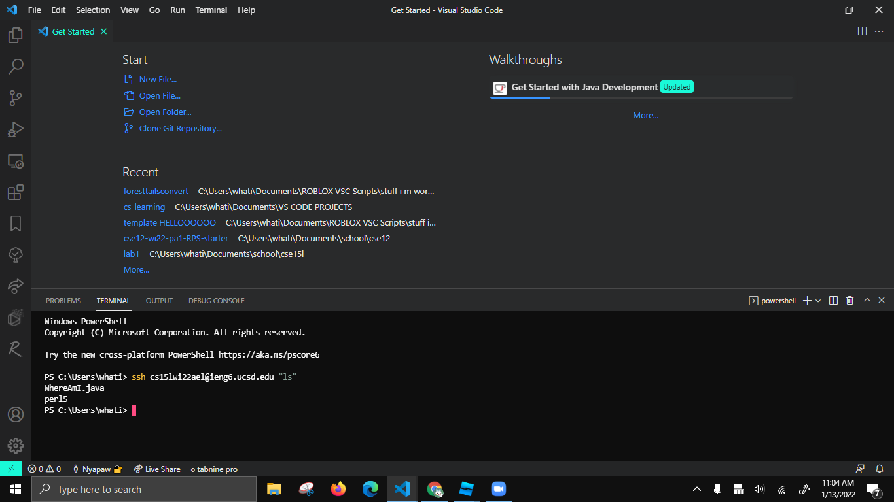

Installing VScode 
- Go to https://code.visualstudio.com/download 

- download the installer
- Install.
- You will get a page like this on startup

---
Remotely Connecting
- Open terminal w/ ``ctrl+shift+` ``
- go to https://sdacs.ucsd.edu/~icc/index.php to find your ieng email username
- Type `ssh <your username here>@ieng6.ucsd.edu `and enter your password



---
Trying Some Commands
- Typing `ls` lists all the files in the current directory
- `Cd` brings you to top directory, `cd /home `takes you to home directory, `cd ..` takes you up 1 level


- `Mkdir` <name> makes a folder
---
Moving Files with scp
- Put the file WhereAmI.java in a directory
```
class WhereAmI {
  public static void main(String[] args) {
    System.out.println(System.getProperty("os.name"));
    System.out.println(System.getProperty("user.name"));
    System.out.println(System.getProperty("user.home"));
    System.out.println(System.getProperty("user.dir"));
  }
}
```
- Run javac and java on it it will print the client information
- Make sure to be in client cli (your PC)
- Type `scp WhereAmI.java <ssh email>` and your password


- Run javac and java on it it will print the server information
---
Setting an SSH Key
- On windows, go to https://docs.microsoft.com/en-us/windows-server/administration/openssh/openssh_keymanagement#user-key-generation 
- Run` ssh-keygen -t ed25519`, type password, Then run this

 
- Ssh the file into server/.ssh/authorized_keys

---
Optimizing Remote Running
- Typing `ssh <your username here>@ieng6.ucsd.edu “ls”` will log you into server and run ls


- Using backticks allow you to run multiple cmds in the same line
- `cp WhereAmI.java OtherMain.java; javac OtherMain.java; java WhereAmI
`