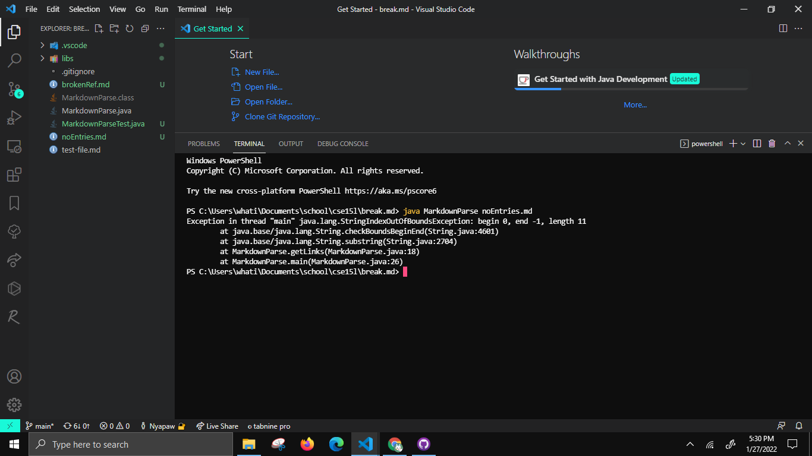
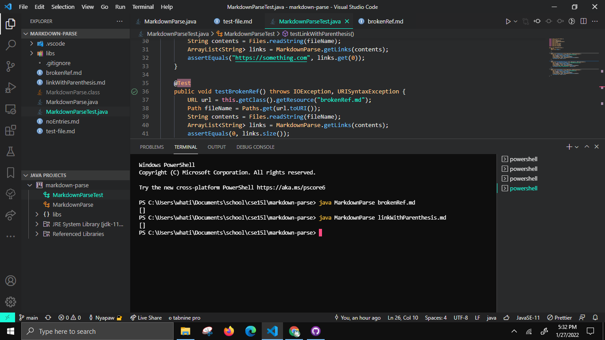

# Week 4 Lab Report

# Bug 1
Code change diff
--

Test File
--
https://github.com/ethanucsd/markdown-parse/blob/main/noEntries.md

Symptom
--

Explanation
--
For the bug, the original behavior was that it would go through the entire file for the left and right parenthesis and the left and right brackets in order. However, it would assume that the failure-inducing input, the markdown file with no link entries, would already have an entry with those left and right parentheses, etc. The symptom was that it threw an exception, when it tried to add the substring of start index -1, which is the index when indexOf doesn't find anything.

# Bug 2
Code change diff
--

Test File
--
https://github.com/ethanucsd/markdown-parse/blob/main/brokenRef.md

Symptom
--

Explanation
--
For the bug, the original behavior was that it would go through the entire file for the left and right parenthesis and the left and right brackets in order. However, it would assume that the failure-inducing input, the markdown file with missing parenthesis/brackets, would contain exactly one for each entry. The symptom was that it threw an exception, when it tried to end the substring of index -1, which is the index when indexOf doesn't find anything.

# Bug 3
Code change diff
--

Test File
--
https://github.com/ethanucsd/markdown-parse/blob/main/linkWithParenthesis.md

Symptom
--

For the bug, the program attempted to split the markdown file into lines, so that for each line it would find out if there is a link, and decide to insert it into the list,but with the failure-inducing input, with parenthesis in the name, it did so incorrectly because it tried to do to the first index of the left parenthesis. The symptom was that there was no entries in the list.