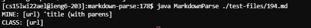

# Week 5 Lab Report

The files are `test-files/194.md` and `test-files/22.md`.

### How you found the tests with different results (Did you use diff on the results of running a bash for loop? Did you search through manually? Did you use some other programmatic idea?)

What I did was I copied the getLinks and any helper methods of my version of MarkdownParse and pasted it into the class version, and in the main method I simply printed the file name if the two resulting arrays from running each getLinks method aren't equal.

# For each test:

### Describe which implementation is correct, or if you think neither is correct, by showing both actual outputs and indicating what the expected output is.

`test-files/194.md`
---

This file has
```md
[Foo*bar\]]:my_(url) 'title (with parens)'

[Foo*bar\]]
```



None of these tests are correct because there should not be anything in the list.

`test-files/22.md`
---

This file has
```md
[foo](/bar\* "ti\*tle")
```


My test is incorrect because the expected output should be `[]`.

### For the implementation that’s not correct (or choose one if both are incorrect), describe the _bug (the problem in the code). You don’t have to provide a fix, but you should be specific about what is wrong with the program, and show the code that should be fixed.

`test-files/22.md`
---

The reason why my test includes the link (the bug) is because it checks per line if `[`, `]`, `(` and `)` exists, and captures everything in between the parentheses. It doesn't account for any text in between `)` and `[`, so I'd edit this part of the code to check if there is text in between it, and don't add it into the list if it does.

```java
int nextOpenBracket = line.indexOf("[", 0);
int nextCloseBracket = line.lastIndexOf("]", markdown.length());
int openParen = line.indexOf("(", nextCloseBracket);
int closeParen = line.lastIndexOf(")", markdown.length());
if (!(nextOpenBracket == -1 || nextCloseBracket == -1 || openParen == -1 || closeParen == -1)) 
    toReturn.add(line.substring(openParen + 1, closeParen));
```

`test-files/194.md`
---

The reason why my code includes the link (the bug) is because unlike the class parser, it doesn't checks the link for a space which is an illegal character. I'd put a space checker here:

```java
int nextOpenBracket = line.indexOf("[", 0);
int nextCloseBracket = line.lastIndexOf("]", markdown.length());
int openParen = line.indexOf("(", nextCloseBracket);
int closeParen = line.lastIndexOf(")", markdown.length());
if (!(nextOpenBracket == -1 || nextCloseBracket == -1 || openParen == -1 || closeParen == -1)) 
    toReturn.add(line.substring(openParen + 1, closeParen));
```
and don't add it into the list if it finds one.